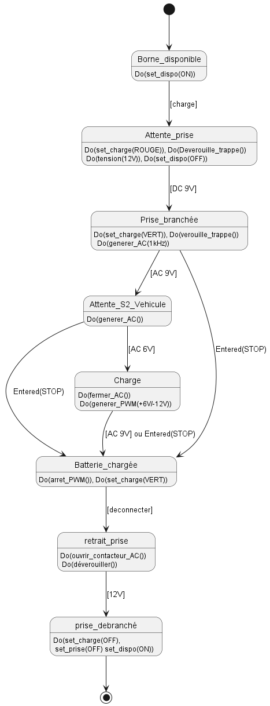
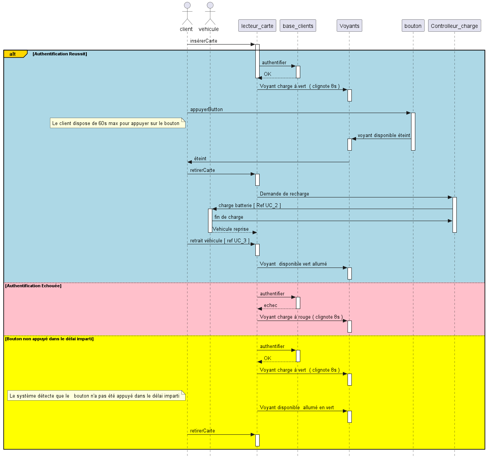

 # GUIDE D'UTILISATION DE PLANTUML

 le but de ce repo est de servir de guide d'utilisation de l'outil PlantUml.

 ## C'est quoi PlantUML ?

 PlantUML est un composant qui permet de dessiner rapidement des diagrammes UML tels que :

* Diagramme de séquence
* Diagramme de cas d'utilisation
* Diagramme de classe
* Diagramme de state charts ( Diagramme d'états et transitions)

On peut également faire des diagrammes non-UML tels que :
* Diagramme de Gantt
* Diagramme de temps
* Diagramme WBS ( Work Breakdown Structure)

### Comment l'utiliser  ?

#### 1- Installer Java 

#### 2- Télécharger le fichier executable plantuml.jar 

Allez sur le github de Plantuml et télécharger le tag le plus récent.
```
https://github.com/plantuml/plantuml.git
```
#### 3- Mettre le fichier .jar dans le meme repertoire où on veut faire les dessins ou bien écrire le chemin relative vers ce fichier .jar lors de l'execution

#### 4- Créer le fichier .puml du diagramme correspondant
Pour avoir une idée concrete, il faut lire la documentation et s'en inspirer.
Lien vers la documentation :
```
https://plantuml.com/guide 
```

#### 5- Execution 
La commande est :\
java -jar plantuml.jar mon_fichier.puml 
ex :
```
java -jar plantuml.jar class.puml 
```

### Example de Diagram


###### statechart réalisé avec PlantUml 

###### diagramme de séquence réalisé avec PlantUml

*NB:*

> Les codes ici sont des exemples que j'ai écrit qui me serviront plutard comme répère pour faire des d'autres diagrammes de systèmes plus complexes.
